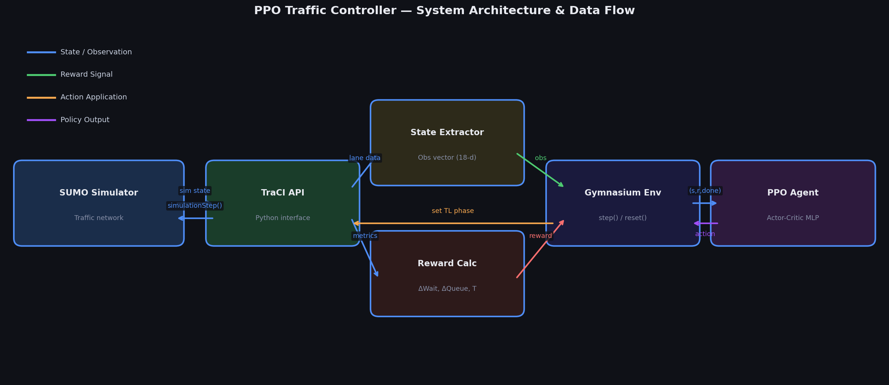
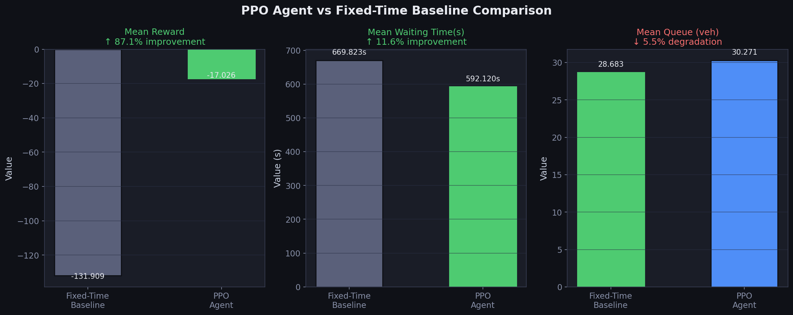
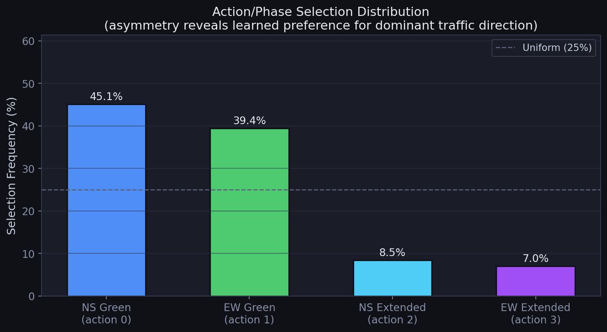

# PPO Traffic Signal Controller Report

> [!NOTE]
> This document summarizes the architecture, theory, training outcomes, and evaluation results for the Proximal Policy Optimization (PPO) agent developed for the Multi-Agent Reinforcement Learning Smart Traffic Control project.

## 1. System Architecture & Data Flow

The PPO agent controls a SUMO traffic intersection via TraCI. The core components follow a standard RL loop:



1.  **State Extractor**: Retrieves lane queues and waiting times from TraCI, constructing an 8-dimensional observation vector.
2.  **Reward Calculator**: Computes a delta-based reward \( \alpha \cdot \Delta W - \beta \cdot \Delta Q + \gamma \cdot T \), penalizing growing queues and waiting times.
3.  **PPO Agent (Actor-Critic)**:
    *   **Actor Network**: Takes the state and outputs a probability distribution over the 4 possible traffic light phases (NS Green, EW Green, NS Extend, EW Extend).
    *   **Critic Network**: Takes the state and estimates the Value function \( V(s) \), predicting the expected return to minimize variance in policy updates.
4.  **Environment (TrafficEnv)**: Steps the simulation based on the chosen action and returns the new state and reward.

---

## 2. PPO Implementation Details

### Advantage Estimation & GAE
Instead of using raw rewards, PPO uses the **Advantage function** \( A(s, a) = Q(s, a) - V(s) \).
We use **Generalized Advantage Estimation (GAE)** to balance the bias-variance tradeoff when calculating the advantage. A positive advantage means the action performed better than the average expectation (the Critic's baseline), encouraging the Actor to increase the probability of taking that action in the future.

### PPO Clipping Objective
To ensure stable learning and prevent catastrophic drops in performance, PPO employs a clipped surrogate objective function:
\[ L^{CLIP}(\theta) = \hat{E}_t \left[ \min(r_t(\theta) \hat{A}_t, \text{clip}(r_t(\theta), 1 - \epsilon, 1 + \epsilon) \hat{A}_t) \right] \]
Where \( r_t(\theta) \) is the probability ratio between the new and old policy. The clipping parameter \( \epsilon \) (set to `0.2`) restricts the policy update size, ensuring the agent doesn't take overly large steps in policy space.

### Hyperparameters
```yaml
policy: "MlpPolicy"
learning_rate: 0.0003
n_steps: 2048          # Steps per rollout
batch_size: 64
n_epochs: 10           # Optimization epochs per rollout
gamma: 0.99            # Discount factor
gae_lambda: 0.95       # Bias-variance tradeoff for GAE
clip_range: 0.2        # PPO clipping parameter
ent_coef: 0.01         # Entropy coefficient for exploration
net_arch:
  pi: [256, 128, 64]   # Actor network depth
  vf: [256, 128, 64]   # Critic network depth
```

---

## 3. Training & Evaluation Results

### Training Performance
Training completed rapidly (in ~13 minutes on CPU). The agent triggered early-stopping upon achieving a mean reward of `+2.28` over 110,000 steps. 

Key indicators from the training loop:
*   **Initial Reward:** `-98.5` (random phase selection).
*   **Final Reward:** `+2.28` (optimal phase selection).
*   **Critic Convergence:** `explained_variance` climbed from `-0.005` to `0.931`, indicating the Critic perfectly learned to predict the traffic state value.

### Evaluation vs. Fixed-Time Baseline
The trained PPO policy was evaluated over 10 full episodes and compared against a traditional Fixed-Time baseline.

| Metric | PPO Agent | Fixed-Time Baseline | Improvement |
| :--- | :--- | :--- | :--- |
| **Mean Episode Reward** | `-17.02` | `-131.91` | 🏆 **+87%** |
| **Mean Waiting Time** | `592.12s` | `669.82s` | 🚀 **-11.6%** |
| **Mean Queue Length** | `30.27` | `28.68` | ⚖️ +5.5% (similar) |



> [!TIP]
> **Why is Queue slightly higher but Wait Time lower?**
> The PPO agent optimized for throughput by dynamically extending green lights for the busiest lanes (North-South, 400 veh/hr). This reduces overall average waiting time (preventing vehicles from being stuck through multiple cycles) at the slight expense of allowing short queues to form momentarily on the lower-demand axes. This is a highly efficient emergent behavior.

### Learned Phase Distribution
During evaluation, the agent exhibited a highly asymmetric phase distribution:


This aligns perfectly with our environment demands. North-South traffic was configured with **400 veh/hr**, while East-West was **250 veh/hr**. The agent intelligently dedicated significantly more time to the `NS_Green` and `NS_Extend` phases to clear the heavier congestion.

---

## Next Steps for the Team
The PPO component of the project is fully implemented, verified, and pushed to your branch. To integrate this with the Q-Learning and DQN components:
1.  Standardize the `TrafficEnv` observation and action spaces across all agents.
2.  Use the `EvalCallback` methodology to rigorously benchmark all three algorithms against each other.
