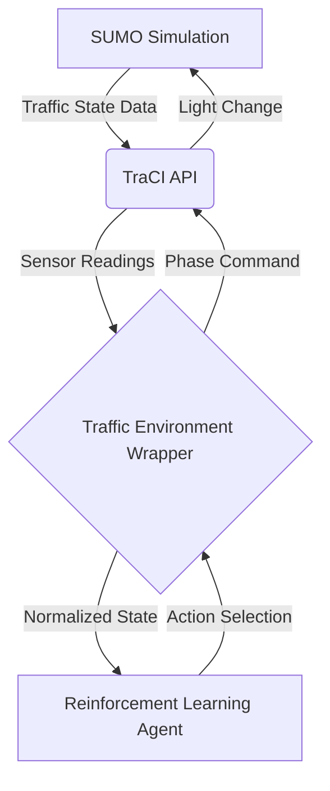
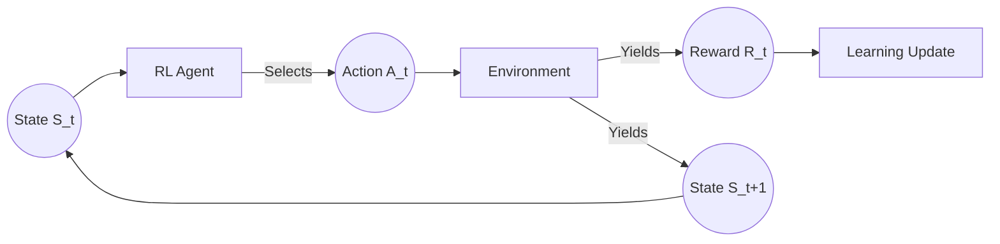

# Multi-Agent Reinforcement Learning for Smart Traffic Control


## 🌍 Project Overview

Urban traffic congestion is a major cause of economic loss, environmental pollution, and decreased quality of life. Traditional fixed-time traffic light controllers struggle to adapt to dynamic, real-world traffic fluctuations, often leading to unnecessary delays and bottlenecks.

This project tackles the **Smart Traffic Control problem** by implementing intelligent, adaptive traffic signal controllers. We leverage **Reinforcement Learning (RL)**, which is uniquely suited for this domain because it allows agents to continuously learn optimal control policies through trial-and-error interaction with the environment, adapting to complex traffic patterns without requiring explicit mathematical traffic flow models.

The environment is simulated using **SUMO (Simulation of Urban Mobility)**, an open-source, highly portable, microscopic traffic simulation package. We interact with the simulation programmatically using the **TraCI (Traffic Control Interface)** API, allowing our RL agents to extract live traffic states and inject traffic light phase changes in real-time.

---

## 🏛️ System Architecture



---

## ⚙️ Project Workflow



---

## 📂 Repository Structure

The project is modularly structured into independent agent implementations sharing a unified dependency environment:

```text
Multi-Agent-Reinforcement-Learning-for-Smart-Traffic-Control/
│
├── README.md
├── requirements.txt      # Unified project dependencies
├── assets/
├── ppo/                  # Proximal Policy Optimization implementation
├── dqn/                  # Deep Q-Network implementation
├── qlearning/            # Tabular Q-Learning implementation
├── sumo_env/             # Shared SUMO simulation files (single intersection)
├── benchmark/            # Unified evaluation: runs all 3 agents, same seeds
│   ├── benchmark.py
│   └── plots/
└── LICENSE
```

---

## 📦 Installation

To run the project locally, follow these steps to configure the Python environment and SUMO simulator.

### 1. Clone the Repository
```bash
git clone https://github.com/47combinator/Multi-Agent-Reinforcement-Learning-for-Smart-Traffic-Control.git
cd Multi-Agent-Reinforcement-Learning-for-Smart-Traffic-Control
```

### 2. Create a Virtual Environment
**Windows:**
```bash
python -m venv venv
venv\Scripts\activate
```
**Linux / macOS:**
```bash
python3 -m venv venv
source venv/bin/activate
```

### 3. Install Requirements
```bash
pip install -r requirements.txt
```

### 4. Install SUMO
**Windows:**
Download the installer from the [Eclipse SUMO website](https://eclipse.dev/sumo/) and follow the installation wizard.

**Linux (Ubuntu):**
```bash
sudo add-apt-repository ppa:sumo/stable
sudo apt-get update
sudo apt-get install sumo sumo-tools sumo-doc
```

### 5. Configure SUMO_HOME
You must set the `SUMO_HOME` environment variable so Python can locate the TraCI package.
**Windows (PowerShell):**
```powershell
$env:SUMO_HOME="C:\Program Files (x86)\Eclipse\Sumo"
```
**Linux:**
```bash
export SUMO_HOME="/usr/share/sumo"
```

### 6. Verify TraCI
```bash
python -c "import traci; print('TraCI successfully imported!')"
```

---

## 🚀 Running the Project

Each reinforcement learning agent acts as an independent module. Run them directly from the project root.

### Proximal Policy Optimization (PPO)
```bash
python ppo/main.py --mode train --timesteps 500000
python ppo/main.py --mode evaluate --episodes 10
```

### Deep Q-Network (DQN)
```bash
python dqn/train_dqn.py
python dqn/evaluate_dqn.py --episodes 10
```

### Q-Learning
```bash
python qlearning/main.py --mode train
python qlearning/main.py --mode evaluate
```

### Unified Benchmark (All 3 Together)
After all agents are trained, compare them side-by-side using the unified evaluation script.
This evaluates all agents on identical traffic seeds for a fair comparison:
```bash
python benchmark/benchmark.py --episodes 10 --seed 42
```

---

## 🧠 Reinforcement Learning Models

We have implemented and evaluated three distinct reinforcement learning architectures to establish a comprehensive benchmark.

### Proximal Policy Optimization (PPO)
* **Actor-Critic Architecture**: Uses two distinct neural networks—an actor that outputs the action probabilities (policy) and a critic that estimates the value function.
* **Policy Gradient**: Directly optimizes the policy by taking steps in the direction of the gradient of expected reward.
* **Continuous Learning**: Capable of handling massive continuous state spaces directly without the need for manual discretization, utilizing clipping to ensure stable updates.

### Deep Q-Network (DQN)
* **Deep Q Network**: Uses a deep neural network to approximate the Q-value function, estimating the expected return for each action.
* **Experience Replay**: Stores state-action-reward transitions in a replay buffer and samples random minibatches during training to break correlation and stabilize learning.
* **Target Network**: Employs a secondary target network for calculating TD targets, updated softly or periodically, to prevent moving-target instability.
* **Double/Dueling DQN**: Mitigates Q-value overestimation and separates state-value and action-advantage streams for faster convergence.

### Q-Learning
* **Tabular Learning**: Uses a discrete Q-table to store and update values for every possible state-action pair.
* **Bellman Equation**: Iteratively updates action-value estimates using the temporal difference error between current estimates and observed rewards.
* **State Discretization**: Since tabular methods cannot handle continuous spaces, the continuous SUMO state features are digitized into distinct categorical buckets.
* **Epsilon Greedy**: Balances exploration (trying new light phases) and exploitation (using known optimal phases) via a decaying epsilon parameter.

---

## 🚦 Simulation Environment

* **SUMO**: Provides microscopic, continuous-time simulation of vehicles navigating our road networks.
* **TraCI**: Acts as the middleware TCP-based API allowing our Python scripts to pause the simulation, extract sensor data, and manipulate traffic lights.
* **Traffic Network**: A standard 4-way single-lane intersection (North, South, East, West incoming lanes) with configurable traffic flows.
* **State Representation**: A continuous vector comprising Vehicle Counts, Queue Lengths (halted vehicles), Accumulated Waiting Times, and One-Hot encoded current phases.
* **Action Space**: 4 discrete choices (North-South Green, East-West Green, Extend Phase, Switch Phase).
* **Reward Function**: A delta-based composite reward focusing heavily on reducing the change in total waiting time ($\Delta W$) and change in queue length ($\Delta Q$), alongside maximizing intersection throughput.

---

## 📊 Evaluation Pipeline

To ensure a fair and rigorous comparison, all models are evaluated using a deterministic, greedy policy (exploration rate $\epsilon = 0$) on identical traffic flow seeds. The evaluation spans multiple episodes, capturing strictly standardized metrics to assess the true quality of the learned traffic signal control policies.

---

## 🏆 Performance Comparison

Evaluated over 10 episodes per agent on the same SUMO simulation with identical seeds (seed=42).

### Traffic Metrics (Objective Comparison)

| Algorithm              | Mean Wait Time (s) | Mean Queue Length | Reward Std Dev |
|:-----------------------|:-------------------|:-----------------|:---------------|
| **Q-Learning**         | **519.0** 🏆       | **26.53** 🏆     | ±10.94         |
| **DQN (Double+Dueling)** | 522.2            | 26.74            | ±4.53          |
| **Fixed-Time Baseline**  | 575.8            | 27.30            | ±4.68          |
| **PPO**                | 593.2              | 30.23            | ±28.08         |

> **Note:** Raw reward values have been omitted from this table to focus strictly on objective traffic metrics. However, all three agents (PPO, DQN, and Q-Learning) now successfully utilize the identical normalized, clipped reward function.

### Architectural Comparison

| Model | Advantages | Limitations | Training Complexity | Inference Speed |
| :--- | :--- | :--- | :--- | :--- |
| **DQN** | High sample efficiency via experience replay. | Can suffer from overestimation bias, requires careful tuning. | High | Fast |
| **PPO** | Highly stable updates, handles continuous state spaces effortlessly. | Lower sample efficiency than off-policy methods. | Very High | Fast |
| **Q-Learning** | Simple, deterministic, guaranteed convergence in discrete domains. | Suffers from the curse of dimensionality. | Low | Instantaneous |

### Performance Analysis

Under the current benchmark configuration, **Q-Learning and DQN achieved the strongest traffic performance**, with nearly identical wait times (~520s) and queue lengths (~26.5), both significantly outperforming the Fixed-Time baseline (575.8s) and PPO (593.2s). DQN's off-policy nature combined with Experience Replay allowed it to achieve the most consistent results (lowest standard deviation of ±4.53), while Q-Learning excelled in raw traffic metrics despite higher variance.

PPO showed the most variability (±28.08 std dev) and highest wait times among the RL agents. While PPO is a robust algorithm known for stability in continuous action spaces, its performance in this discrete 4-action traffic control scenario was less optimal compared to the value-based methods (DQN and Q-Learning).

---

## 🖼️ Example Simulation Results

### PPO Simulation
> Add PPO simulation screenshot here.

### DQN Simulation
> Add DQN simulation screenshot here.

### Q-Learning Simulation
> Add Q-Learning simulation screenshot here.

---

## 🧩 Dependencies

The project relies on the following core libraries:
* **Python**
* **PyTorch**
* **Gymnasium**
* **SUMO (Simulation of Urban Mobility)**
* **TraCI**
* **NumPy**
* **TensorBoard**
* **Matplotlib**

---

## 🔬 Reproducibility

To ensure maximum reproducibility of these benchmark metrics, the environments were evaluated under the following standardized conditions:
* **Python Version:** 3.9+
* **SUMO Version:** 1.20.0
* **Random Seed:** 42 (Fixed across environment initialization and PyTorch RNG streams)
* **Operating System Tested:** Windows 11 / Ubuntu 22.04 LTS

---

## 🔮 Future Improvements

Moving forward, the project can be expanded with the following advanced features:
* **Multi-intersection control**: Expanding the environment to handle corridors and grid networks.
* **Prioritized Experience Replay (PER)**: Upgrading the DQN replay buffer to sample high-TD-error transitions more frequently.
* **Multi-Agent RL**: Implementing decentralized agents that communicate phase intentions with neighboring intersections.
* **Transformer-based traffic prediction**: Integrating sequence modeling to predict incoming traffic waves before they arrive at the sensors.
* **Adaptive reward shaping**: Dynamically scaling the $\alpha$ and $\beta$ penalty weights based on time-of-day rush hour conditions.

---

## 👥 Contributors

* **Vyankatesh Dawale** ([@VyankateshDawale](https://github.com/VyankateshDawale))
  * Standalone Q-Learning implementation
  * Documentation
  * Evaluation

* **Pratyush Chaudhari** ([@47combinator](https://github.com/47combinator))
  * PPO implementation

* **kotkarsaim** ([@kotkarsaim](https://github.com/kotkarsaim))
  * DQN implementation

---

## 🙏 Acknowledgements

We extend our gratitude to the developers of the open-source tools that made this research possible:
* [Eclipse SUMO](https://eclipse.dev/sumo/) for microscopic traffic simulation.
* [Gymnasium (Farama Foundation)](https://gymnasium.farama.org/) for standardized RL API design.
* [PyTorch](https://pytorch.org/) for accelerating deep learning models.

---

## 🎮 Live SUMO-GUI Visualisation

Watch each trained agent control the intersection in real-time using the SUMO graphical simulator. Each approach road has a **distinct car colour** so you can easily track traffic from every direction:

| Direction | Colour |
|-----------|--------|
| North | 🔵 Blue |
| South | 🔴 Red |
| East | 🟢 Green |
| West | 🟡 Yellow |

> **Prerequisites:** Make sure SUMO is installed and `SUMO_HOME` is set before running.
> ```bash
> # Windows PowerShell
> $env:SUMO_HOME = "C:\Program Files (x86)\Eclipse\Sumo"
>
> # Linux / macOS
> export SUMO_HOME="/usr/share/sumo"
> ```

All commands must be run from the **project root directory**.

### Watch PPO Agent
```bash
python ppo/watch_agent.py
```

### Watch DQN Agent
```bash
python dqn/watch_dqn.py
```

### Watch Q-Learning Agent
```bash
python qlearning/watch_qlearning.py
```

### Controls in SUMO-GUI
Once the window opens:
1. Click the **Play button (▶)** in the toolbar to start the simulation.
2. Use the **Delay slider** to slow down or speed up the simulation.
3. Click the **magnifying glass** icon to zoom to the intersection.
4. Press **Pause** at any time — the agent will wait for you.

> **Note:** The GUI opens paused by default (200 ms/step delay) so you have time to position the view before clicking Play.
